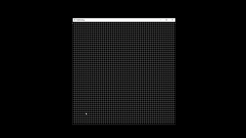

# About
C++ pathfinding visualization that implements the A* Pathfinding Algorithm. This project was inspired by Tech With Tim's pathfinding visualization in python. The SFML header files and .dll files are not mine; they are used for the graphics.

## Usage
The start node is yellow, the end node is cyan, the barrier nodes are white, and the path nodes are magenta

## Demo
