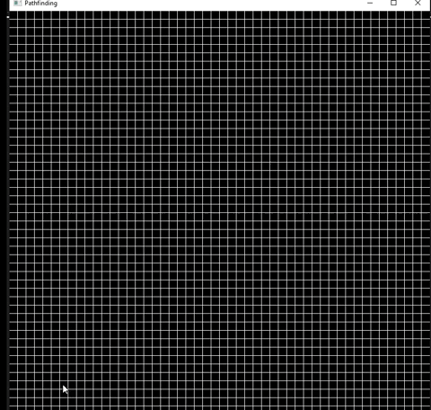

# About
C++ pathfinding visualization that implements the A* Pathfinding Algorithm. This project was inspired by Tech With Tim's pathfinding visualization in python. The SFML header files and .dll files are not mine; they are used for the graphics.

## Usage
Start by placing the start and end nodes by clicking at the desired location (the start node is yellow and the end node is cyan). Then, place the barrier nodes (white) by clicking or clicking and dragging. Press space to start the algorithm.

## Demo
